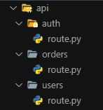

# FastAPI-Router

*Efficient Backend, Agile Development.*

FastAPI-Router is a plugin for applications built with `FastAPI` that enables the development of backend applications with a workflow similar to Next.js. This means you can create efficient and modern backend applications with FastAPI-Router, taking advantage of its capabilities in a manner akin to the workflow in Next.js.

Example:

```python
from fastapi import FastAPI
from fastapi_router import init_main_route

# Init FastAPI application
app = FastAPI()

# Init fastapi-route
init_main_route(app)

```

## API Folder organization

In the FastAPI-Router library, the organization of files within the directory mirrors the route structure, akin to the approach in `Next.js`.

Each nested folder signifies a route segment, aligning with a corresponding segment in the URL path.

However, the definition of a route doesn't become publicly accessible until a route.py file is added to the respective route segment. This file, acting as the handler, determines the behavior and functionality associated with the specific endpoint. FastAPI-Router leverages this file structure to seamlessly generate and map routes, providing an intuitive and efficient way to structure and manage API endpoints.



### route.py

A route file enables the creation of customized request handlers for a specified route. It supports the following HTTP methods: `GET`, `POST`, `PUT`, `PATCH`, `DELETE`, `HEAD`, `TRACE` and `OPTIONS`.

```python

def GET(): ...

def POST(): ...

def PUT(): ...

def PATH(): ...

def DELETE(): ...

def HEAD(): ...

def TRACE(): ...

def OPTIONS(): ...

```

By default, fastapi-router expects a folder named `'api'` to exist. In case you need to change the name or have a project where you want to implement fastapi-router without that specific name, you can modify this by passing `pathDir` as an argument to the `init_main_route` function.

Example:

```python

# For root folder
init_main_route(app, pathDir='app')

init_main_route(app2, pathDir='app/routes')

```

If the name `'route'` doesn't suit you and you want to change it to another name to define the methods of the routes, you can pass `nameRouteFile` as an argument to the `init_main_route` function.

Example:

```python

# Changing the route file name
init_main_route(app, nameRouteFile='methods')

```
